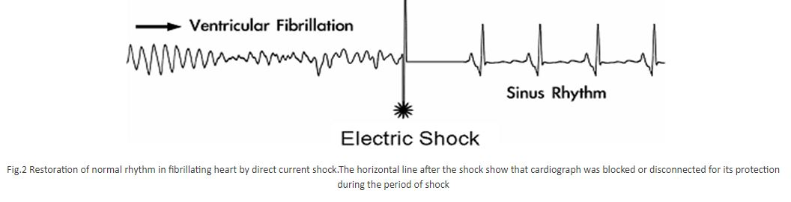
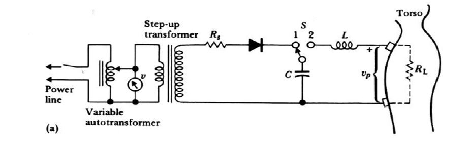
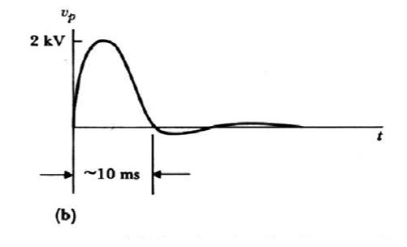
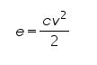

### Theory

Ventricular fibrillation is serious cardiac emergency resulting from asynchronous contraction of heart muscle.This uncoordinated movement of ventricle walls of the heart may result from electric shock or from abnormlities of body chemistry

Main problem of fibrillation is continuously stimulation of adjacent cells of heart muscle fibers.so there is no synchronized succession of events that follow heart action.

This Fibrillation leads to loss of cardiac output and irreversible brain damage or death if not reversed within 5 minutes of onset

Ventricular fibrillation can be converted into more efficient rhythm (fig.b) by applying a high energy shock to the heart. This sudden surge across the heart cause all muscle fibers to contract simultaneously ,possibly the fibers nay then respond to normal physiological intrinsic pulse.

Defibrillator:

The instrument for administering the shock is called a defibrillator.
So it is used to reverse fibrillation of the heart. Electric shock by defibrillator is used to reestablish normal activity.
The shock can be delivered to the heart by means of electrode placed on chest of the patient(External defibrillation) or the electrode may be held directly against the heart when the chest is open(internal defibrillation).
Higher voltage are required for external defibrillation than for internal defibrillation

Figure 3.a show basic circuit diagram of DC Defibrillator. A Variable auto transformer forms the primary of a high voltage transformer. The output voltage transformer is rectified by a diode rectifier and is connected to vacuum type high voltage change over switch. In position 1, the switch is connected to one end of an oil filled micro farad capacitor. In this position, the capacitor charge to a voltage set by the positioning of the auto transformer. When the shock is delivered to the patient, a foot switch or a push button mounted on the handle of the electrode is operated. The high voltage switch change over to position 2 and the capacitor is discharged across the heart through the electrode.

The inductor in the circuit slow down the discharge from capacitor by induced counter voltage. This give the output pulse a physiologically favorable shape. The dis advantage of using inductor is that any practical inductor will have its own resistance and dissipates part of the energy during the discharge process. The shape of waveform that appears across electrodes will depend upon the value of the capacitor and inductor used in the circuit. The discharge resistance which the patient represent for defibrillating pulse may be regarded as purely ohmic resistance of 50-100 &Omega; approximately for typical electrode size of 80 cm2. The typical discharge pulse of defibrillator is shown in fig.3 b.

Using this design, external defibrillation uses:

-50 to 100 Joules of energy when electrodes are applied directly to the heart
-Up to 400 Joules when applied externally

* Energy stored in the capacitor follows:

* Capacitors used range from 10 to 50  &mu; F
* Voltage using these capacitors and max energy (400J) ranges from 1 to 3 kV
* Energy loss result in the delivery of less than theoretical energy to the heart

Defibrillator: Rectangular-Wave

* Capacitor is discharged through the subject by turning on a series silicon-controlled rectifier.
* When sufficient energy has been delivered to the subject, a shunt silicon-controlled rectifier
short-circuits the capacitor and terminates the pulse, eliminating a long discharge tail of the
waveform

* Output control can be obtained by varying:

         -Voltage on the capacitor
         -Duration of discharge

* Advantages of this design:

         -Requires less peak current
         -Requires no inductor
         -Makes it possible to use physically smaller electrolytic capacitors
         -Does not require relays
		 

Monophasic pulse width is typically programmable from 3.0 to 12.0 msec
* Biphasic positive pulse width is typically programmable from 3.0 to 10.0 msec, while the negative pulse is from 1.0 to 10.0 msec
* Studies suggest that biphasic pulses yield increased defibrillation efficacy with respect to Monophasic pulses

